  <picture>
    <source media="(prefers-color-scheme: dark)" srcset="dark.svg">
    <source media="(prefers-color-scheme: light)" srcset="light.svg">
    
  </picture>

  
  &nbsp;&nbsp;&nbsp;&nbsp;&nbsp;&nbsp;&nbsp;&nbsp;&nbsp;&nbsp;&nbsp;&nbsp;&nbsp;&nbsp;&nbsp;&nbsp;
  
  &nbsp;&nbsp;&nbsp;&nbsp;&nbsp;&nbsp;&nbsp;&nbsp;&nbsp;&nbsp;&nbsp;&nbsp;&nbsp;&nbsp;&nbsp;&nbsp;
  

 

  <h2>Featured Security Projects</h2>

---

### ⚔️ **[PHANTOM-X](https://github.com/omkarmahadik96/PHANTOM-X)**
> **Premium Security Intelligence Platform**
> 
> * **Features:** 72+ audited security tools, custom cyberpunk themes, real-time log highlighting, and docker-ready Kali support.
> * **Tech Stack:** Shell Scripting, Python, Docker, Kali Linux
> * **Status:** 

### 🔍 **[ThreatX](https://github.com/omkarmahadik96/ThreatX)**
> **Enterprise-Grade Phishing & Email Intelligence System**
> 
> * **Features:** Multi-channel phishing detection (URLs, texts, Gmail) using AI/ML vector classifiers & real-time PhishTank API.
> * **Tech Stack:** Python, Flask, Firebase, Scikit-Learn, Vercel
> * **Status:** 

### 🌐 **[ShadowScan-Pro](https://github.com/omkarmahadik96/ShadowScan-Pro)**
> **Next-Gen Cyber Surveillance & Threat Intelligence Workbench**
> 
> * **Features:** Real-time OSINT monitoring, multi-tenant session isolation, and tactical alert telemetry.
> * **Tech Stack:** React.js, TypeScript, Node.js, Express, Prisma ORM, TailwindCSS
> * **Status:** 

### 🔑 **[FortressPass](https://github.com/omkarmahadik96/Password-Strenght-Analyzer)**
> **Password Intelligence OS & Strength Analyzer**
> 
> * **Features:** Shannon Entropy calculations, Web Crypto API hashing, k-Anonymity breach checker, and physics-based particle confetti.
> * **Tech Stack:** JavaScript (ES6+), HTML5/CSS3, Web Audio API
> * **Status:** 

---

 

  
   
  
  

 

  <picture>
    <source media="(prefers-color-scheme: dark)" srcset="https://raw.githubusercontent.com/omkarmahadik96/omkarmahadik96/output/github-snake-dark.svg" />
    <source media="(prefers-color-scheme: light)" srcset="https://raw.githubusercontent.com/omkarmahadik96/omkarmahadik96/output/github-snake.svg" />
    
  </picture>

